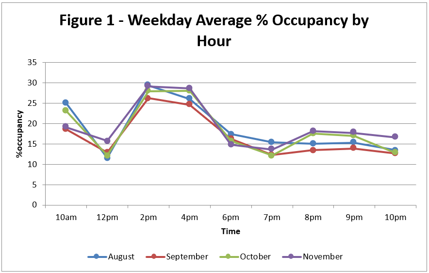
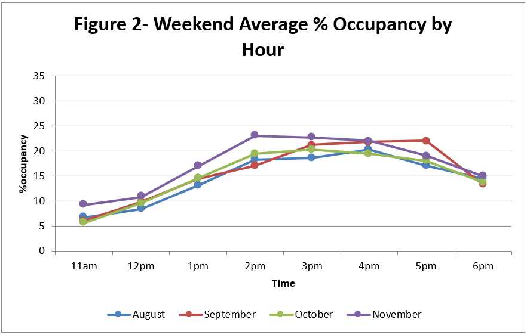
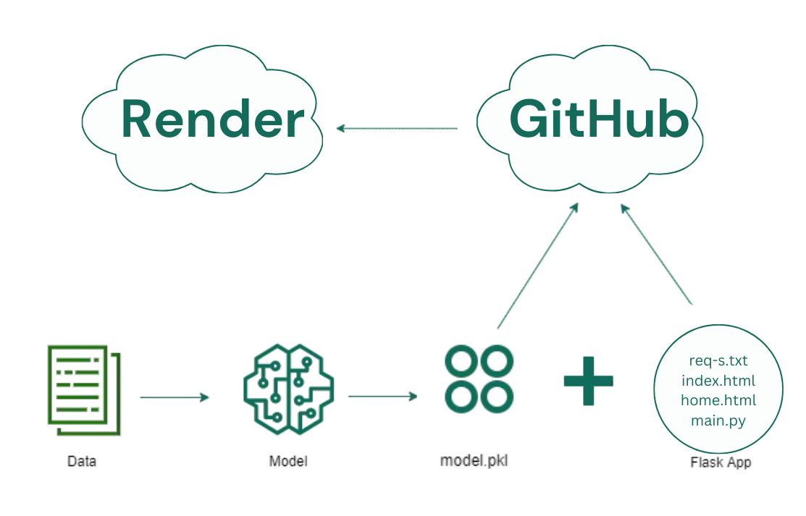
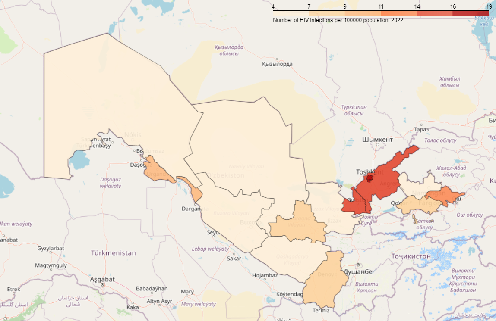
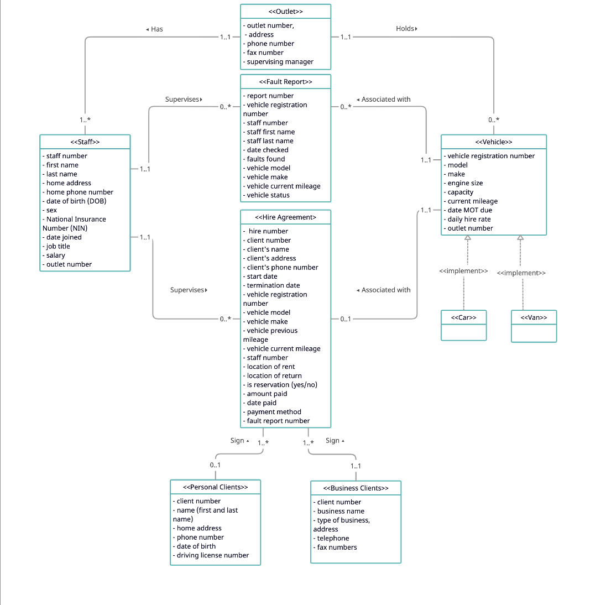

Welcome to my Data Analytics Portfolio where I showcase my various projects ranging from my university's library data occupancy analysis to research in applied mathematics on partial differential equations to model waves such as tsunamis.

# [Project 1: Analyzing library data occupancy data](https://github.com/normatovbekzod/library_data_analysis)
## Aim: 
### Develop 6 stages of the Data Analytics Life Cycle with the aim of analyzing Yale-NUS library occupancy data in order to reveal insights into when the library is the busiest and which sections of the library are under-used.
## Objectives:
 - create a data collection method that can be used by students working for the library
 - clean data using Python
 - prepare data for analysis by exporting it in Excel format
 - analyze occupancy data using Excel and Python
 - data visualizations using Excel
 - a monthly report with key insights and findings
 - find out which library areas are under-used by analyzing the popularity of each seat (based on occupancy count)
 
## Data Collection
Data is collected hourly during library opening hours by students working for the library by manually filling in the qualtrics form. This data collection method is secure as only those with the password to the form could collect data; however, it is also prone to human errors. The dataset is also secure on the qualtrics website and raw data could be downloaded in the CSV format. 

## Data Cleaning
Data Cleaning is performed in Python. In this stage I handle missing data, check for duplicates and outliers, which usually indicate a human error in the data collection process.   

## Data Processing
Data Processing is also performed in Python. The data processing step involves declaring several functions that help turn raw data into proper and easily understandable parameters such as the function monthfinder, which turns raw input data into the names of the months. Processed data is then exported into the Excel file for further analysis.

## Data Analysis and Visualizations
Data analysis involved performing several EDAs and visualizing occupancy counts in various sections of the library throughout the day and how some of the metrics such as average occupancy on weekends and weekdays compare to other months. 
Below are two examples of such visualizations. 

  
  

## Reporting and Actions
Main insights and visualizations are included in a monthly report prepared at the start of each month. This report is then shared with the library managers in order to optimize the usage of library spaces. Based on the insight into occupancy levels in various library spaces, I presented solutions to increase the usage of the main 4 library areas by 20% and spearheaded with the guidance of my manager a major reallocation of 30 library student assistants to different shifts based on how busy the library is during a library shift. 

# [Project: Machine Learning HIV Classifier Deployment on Render Using Flask](https://github.com/normatovbekzod/hiv_classifier/tree/main)
In this project, we want to tackle the lack of awareness of the importance of regular testing for HIV especially among the at-risk groups. The main problem that workers at the Republican Centre for the Fight Against AIDS (RCFAA, for short) observed is that most HIV-positive patients only find out about their diagnosis after developing the first symptoms. In the case of at-risk groups, this increases the chance of them passing the virus to another person through sexual intercourse or repeated use of syringes. Hence, there is a lack of preventive awareness of the importance of regular testing especially when the person observes certain behaviors or lifestyles associated with a higher risk of HIV infection. 

Deploying a real-time HIV test predictor can if not solve then at least address all these issues. As such, the goal of this project is to build an HIV test result classifier based on the HIV data from the Republican Centre for the Fight Against AIDS in Tashkent, Uzbekistan, and then deploy it so that the predictor can easily be accessed through a QR code. The project consists of two stages:
The goal of the classifier is to encourage people who fall into at-risk groups including sex workers and injective drug users to get tested as well as to increase the amount of people getting tested at the annual free HIV testing day. 

### The choice of Render 
Render is a unified cloud to build and run apps and websites with free SSL, global CDN, private networks, and automatic deploys from Git. Compared to platforms like Heroku, it offers a Free tier for all web services, which makes it the best candidate to host our Flask app. It is relatively straightforward to deploy a Flask app on Render given only a few requirements and its compatibility with Git will allow us to deploy our app seamlessly. 
Below is an overview of the framework of this project.

  

# [Project 2: Global COVID-19 vaccination tracker](https://public.tableau.com/app/profile/bekzod.normatov/viz/Global_vax_tracker_2021/GlobalVaccineTracker)
### Motivation
At the end of 2021, I was back home in Uzbekistan and was unpleasantly surprised to find out that my family and friends believed that most of the people in the world are not getting vaccinated and it is only the minority that agrees to get one dose of the vaccine let alone both doses. I could see where they were coming from as the vaccination program in Uzbekistan was slowly rolling in. Hence, I identified a problem of the lack of information.

### Problem
The majority of people in Uzbekistan have no idea of the success of the vaccination program in other countries of the world as well as on the growing number of people getting vaccinated in Uzbekistan alone.

### Solution
I decided to find a way to visualize the data on vaccination status around the world in an interactive and communicative. I found Tableau to be a great tool for that.
As a result, I created a dashboard where my family and friends could see how the world is changing and how people are getting vaccinated. I achieved that by visualizing some important metrics as well as the plots such as share of population partially and fully vaccinated by country, or region. This visualization helped me convince both my parents and my grandmother to get vaccinated. The current version of the dashboard can be accessed here: https://public.tableau.com/app/profile/bekzod.normatov/viz/Global_vax_tracker_2021/GlobalVaccineTracker. 

# [Project 3: Data Analysis for the Day Care HIV Centre](https://github.com/normatovbekzod/hiv_by_uzb_region)
My volunteer experience at the National Day Care Centre for children and families affected by HIV helped me better understand the problems and stigmas HIV individuals face in Uzbekistan. During my time there I have primarily worked with sensitive data involving HIV statistics as well as the data of current patients. My work involved encrypting any personal data that could reveal or lead to the identity of the individual as well as helping the centre in its advocacy efforts. I have done that by visualizing some metrics such as the one below on the prevalence of HIV in different parts of Uzbekistan. Unfortunately, due to local legal complexities, most of the output of the data analysis involving HIV statistics cannot be shared openly. 

  

Additionally, I led the transition to a paperless data collection pratice in the centre by implementing a reliable and convenient data entry method utilizing google forms. I believe finding the right tools to use for data collection and data analysis is an important part of data analytics. Hence, google forms presented the most intuitive and easy way for the centre to collect data on its patients. Moreover, it was secure as only those with access to the centre's google account could view the data collected. As for me, using google forms allowed for easy access to the CSV data, which I used for further analysis.

# [Project 4: Database Implementation](https://github.com/normatovbekzod/Database_system) 
## Problem: 
A car rental company Smiles needs a database software to manage all its data on clients, vehicles, staff and rental contracts. The resoning is that with the growth of its business and the number of its outlets, there has been poor data management and poor data flow between its branches.

## Solution:
We create a database in MySQL workbench using an appropriate schema that we develop based on the information provided about the business. As this is a fictional business, we create mock data for each of the tables, which is stored in the src folder. SQL queries used to populate and modify data is stored in the sql folder.

Below is the Entity Relation Diagram fo the database we implement.

# [Project 5: Sentiment Analysis of movie reviews using nltk data](https://github.com/normatovbekzod/movie_reviews)
I rely on reviews a lot when deciding whether to watch a particular movie. Hence, as part of the Programming for Data Science class, I wanted to train a model to classify movie reviews. The goal of this model is to predict whether a given movie review is positive or negative.
Some key insights into the project:
- Dataset was taken from nltk movie reviews dataset
- The dataset was split into training and testing sets
- Algorithm used: K-nearest means, TF-IDFs, Singular Value Decomposition(SVD)
- Accuracy rate achieved: 80.6%
